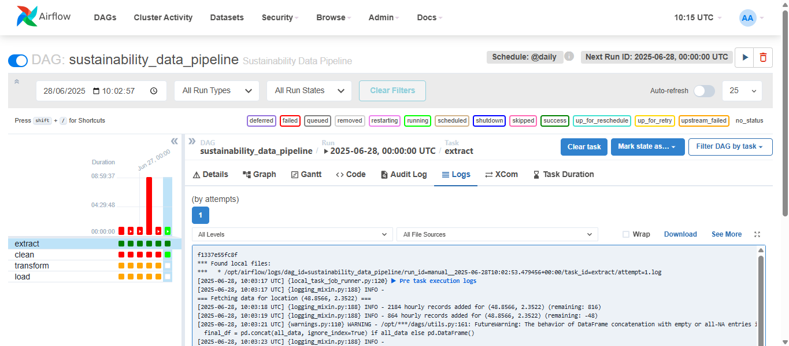
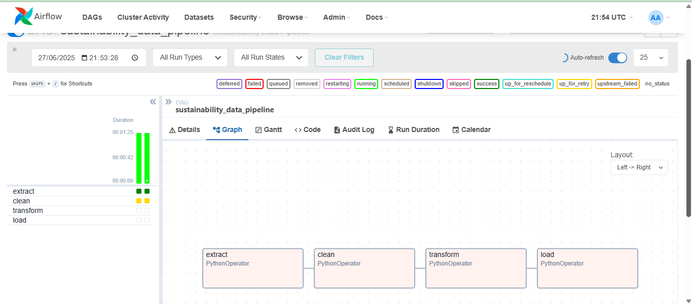

# ETL-Sustainability-Pipeline

This project implements a complete ETL (Extract, Transform, Load) pipeline. The goal is to acquire air quality and sustainability-related data from an open API, clean and transform the data, load the final dataset into a datawarehouse (SQLite) and create a pipeline using DAG Airflow

## Automated Pipeline using Dag Airflow

## Data Acquisition

I developed a Python script `ExtractTask_ETL.ipynb` in Extract folder to fetch hourly weather data from the Open-Meteo API (https://api.open-meteo.com/v1/forecast) for sustainability analysis, including temperature, humidity, precipitation, wind speed, and weather codes.

### 1. Fetching Data from an API
The script retrieves data for four French cities (Paris, Lyon, Marseille, Bordeaux) using their coordinates. It uses two functions:

- **fetch_weather_data(latitude, longitude, needed_hours)**: Fetches up to 3000 hours of data per location via iterative API calls (90-day limit per call), storing results in a pandas DataFrame with added metadata (latitude, longitude).
- **collect_all_locations(locations, needed_hours)**: Iterates over locations, combines DataFrames, and saves 12,000 records to "weather_data_extracted.csv".

### 2. Error Handling
- **HTTP Errors**: A `requests` session with a `Retry` strategy handles temporary errors (429, 500, 502, 503, 504) with up to 3 retries and exponential backoff (1s, 2s, 4s). For 429 (rate limit), it waits 10 seconds.
- **Specific Errors**: Handles 404 errors (invalid URL/parameters) and logs other HTTP errors.
- **Connection Errors**: Catches network issues (e.g., timeouts) with clear messages.
- **Missing Data**: Checks for missing "hourly" data in API responses and stops if none is returned.
- **API Limits**: Includes pauses (1s between requests, 2s between locations) to avoid rate limits.

### Results
The script collected 12,000 records (7392 non-null for weather variables) and saved them to a CSV file. It meets both requirements by fetching sustainability data via an API and robustly handling errors like rate limits and missing data.

## Data Cleaning

In this Notebook `Cleaning_Task.ipynb` in Transform folder, I cleaned, the extracted dataset.

### 1. Initial Dataset
Pandas DataFrame with 12,000 entries and 8 columns: `time` (object), `temperature_2m`, `relative_humidity_2m`, `precipitation`, `wind_speed_10m`, `weather_code` (float64), `latitude`, `longitude`. Columns except `time`, `latitude`, `longitude` had 7,392 non-null entries, with missing values from March 14, 2025, 23:00:00 to January 24, 2025, 00:00:00.

### 2. Cleaning Steps
- **Data Types**: Converted `time` to `datetime64[ns]` and `weather_code` to category.
- **Sorting**: Sorted by `time` (descending), reset index.
- **Missing Values**: Kept first third of rows with missing values (~1,536), dropped others, yielding 8,928 rows.
- **Location Split**: Divided into four DataFrames by unique `latitude` and `longitude`.
- **Imputation**: Used SVR (linear kernel, 72-step sequences) for numerical columns (`temperature_2m`, `relative_humidity_2m`, `precipitation`, `wind_speed_10m`). Imputed `weather_code` with mode.
- **Final Dataset**: Concatenated to 8,928 entries, no missing values, no duplicates.

## Data Transformation

This task processes a weather dataset (`weather_data_cleaned.csv`, 8,928 entries, 8 columns) through formatting, enrichment, aggregation, feature engineering, and normalization:

### 1. **Data Import and Type Conversion**
   - Load dataset into a pandas DataFrame.
   - Convert `time` to `datetime64[ns]` and `weather_code` to `category`.

### 2. **Location Enrichment**
   - Extract unique `latitude` and `longitude` pairs.
   - Perform reverse geocoding to obtain location names.
   - Create `location_df` with `latitude`, `longitude`, and `location`.
   - Merge with original DataFrame, setting `time`, `weather_code`, and `location` to appropriate types.

### 3. **Time-Based Aggregation**
   - Define `transform` function:
     - Bin `time` into `time_of_day` categories: `Night` (0–6), `Morning` (6–12), `Afternoon` (12–18), `Evening` (18–24).
     - Extract `date` from `time`.
     - Group by `latitude`, `longitude`, `date`, `time_of_day`:
       - Mean: `temperature_2m`, `relative_humidity_2m`, `precipitation`, `wind_speed_10m`.
       - Mode: `weather_code`.
       - First: `location`.
     - Set `time_of_day`, `weather_code`, and `location` as `category`.
   - Output: `df_Timerid: df_TimeOfDay (1,488 entries, 10 columns).

### 4. **Feature Engineering**
   - Add `heat_index`: If `temperature_2m` ≥ 20°C, compute as `temperature_2m + 0.33 * relative_humidity_2m - 0.7`; else, use `temperature_2m`.
   - Add `is_raining`: 1 if `precipitation` > 0, else 0 (`int32`).

### 5. **Normalization**
   - Standardize `temperature_2m`, `relative_humidity_2m`, `precipitation`, `wind_speed_10m`, `heat_index` using `StandardScaler`.

### 6. **Output**
   - Final DataFrame (`df_normalized`): 1,488 entries, 12 columns (`float64`: 7, `category`: 3, `object`: 1, `int32`: 1).

## Data Loading

I developed a Python script that loads weather data from `weather_data_transformed.csv` into a SQLite database (`weather_database.db`). It:

### 1. **Imports Data**
- Reads the CSV into a Pandas DataFrame.

### 2. **Preprocesses Data**
Converts:  
- `time_of_day` and `location` to categories
- `weather_code` to string
- `date` to `datetime.date`
- `is_raining` to `int32`.
### 3. **Sets Up Database**
- Connects to SQLite
- Creates `Locations` (with `location_id`, `latitude`, `longitude`, `location`) table
- Creates `Weather_Observations` (with weather metrics and foreign key `location_id`) table   

### 4. **Inserts Data**
- Uses SQLAlchemy to insert unique locations into `Locations`
- Maps `location_id` to the DataFrame, and inserts weather data into `Weather_Observations`
    
### 5. **Verifies** 
- Prints the first five rows of both tables

## Challenges Encountered  
### 1.	Finding a Suitable API
A significant challenge was identifying a reliable and accessible API for environmental metrics, such as weather data, air quality, or sustainability indexes. Several APIs were explored, including the European Environment Agency (EEA), World Air Quality Index, OpenAQ, and Copernicus Atmosphere Monitoring Service. However, these APIs either lacked comprehensive historical weather data, had restrictive access, or were not suitable for the required metrics. Ultimately, the Open Meteo API was selected for its free access, comprehensive weather variables, and reliable historical data, though it required careful handling of rate limits and chunked requests.
### 2.	Model Training Time for Imputation  
The SVR models used for imputing missing numerical values were computationally intensive. Training these models on temporal sequences (72-hour windows) for multiple columns across four locations was time-consuming, especially for large datasets. To mitigate this, the pipeline was optimized to train models only on non-missing data and to process each location independently, though this still required significant computational resources.
